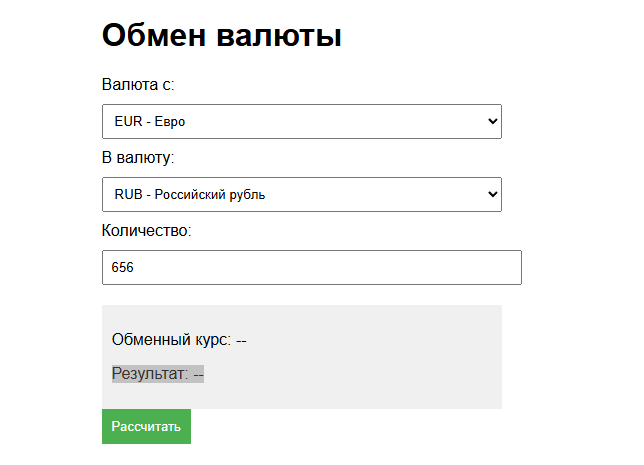
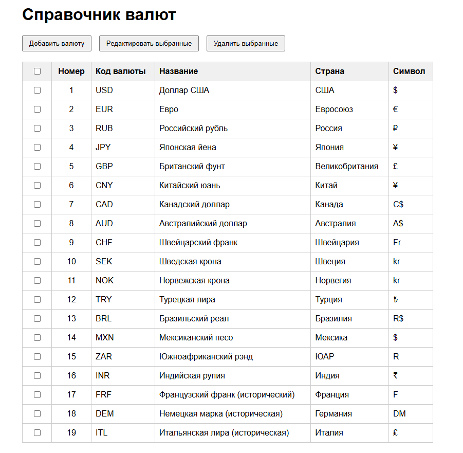
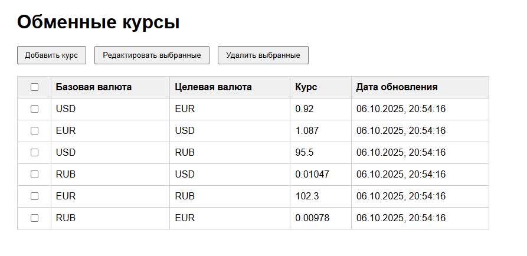

# Проект “Обмен валют”

Данный проект является, слегка, адаптированной версией Java Роадмап Сергея Жукова (https://zhukovsd.github.io/java-backend-learning-course/projects/currency-exchange/)

<span style="color:red">Проект реализовывать стандартными средствами и подходами Jmix и Spring Boot.</span>

Приветствуется сообщить об ошибках, найденных, в данном описании.

#### Ключевые цели
- Знакомство с Jmix
- Знакомство с MVC
- Знакомство с ORM
- Знакомство с REST API — правильное именование ресурсов, использование HTTP кодов ответа
- Знакомство с SQL — базовый синтаксис, создание таблиц
- Знакомство c Docker

#### Этапы проекта
1. Создать простой Jmix проект “Обмен валют”
2. Создать REST API для данного проекта (Spring JDBC)
3. Интеграция с внешним сервисом `https://www.cbr.ru/scripts/XML_daily.asp?date_req=06/10/2025`
4. Деплой


# Jmix
Предварительные экранные формы:







# База данных

#### Таблица Currencies
| Колонка   | Тип    | Комментарий                   |
|-----------|--------|-------------------------------|
| ID        | UUID    | Автоинкремент, первичный ключ |
| Code      | Varchar | Код валюты                    |
| FullName  | Varchar | Полное имя валюты             |
| Sign      | Varchar | Символ валюты                 |

#### Таблица ExchangeRates
| Колонка          | Тип          | Комментарий                                                                 |
|------------------|--------------|-----------------------------------------------------------------------------|
| ID               | UUID          | Автоинкремент, первичный ключ                           |
| BaseCurrencyId   | UUID          | UUID базовой валюты, внешний ключ на Currencies.UUID                            |
| TargetCurrencyId | UUID         | UUID целевой валюты, внешний ключ на Currencies.UUID                            |
| Rate             | Decimal(6)   | Курс обмена единицы базовой валюты к единице целевой валюты                 |
| createDate       | Timestamp    | Время заведения курса                                                      |

# REST API:
Методы REST API реализуют CRUD интерфейс над базой данных - позволяют создавать (C - create), читать (R - read), редактировать (U - update), удаление (D - delete).

## Валюты:

`GET /currencies`

Получение списка валют.

 Пример ответа

```json
[
    {
        "id": 0,
        "name": "United States dollar",
        "code": "USD",
        "sign": "$"
    },
    {
        "id": 0,
        "name": "Euro",
        "code": "EUR",
        "sign": "€"
    }
]
```
#### HTTP коды ответов
- Успех - 200
- Ошибка (например, база данных недоступна) - 500

`GET /currency/EUR`

Получение конкретной валюты. Пример ответа:

```json
{
    "id": 0,
    "name": "Euro",
    "code": "EUR",
    "sign": "€"
}
```
#### HTTP коды ответов:
- Успех - 200
- Код валюты отсутствует в адресе - 400
- Валюта не найдена - 404
- Ошибка (например, база данных недоступна) - 500

`POST /currencies`

Добавление новой валюты в базу. Данные передаются в теле запроса в виде полей формы (x-www-form-urlencoded). Поля формы - name, code, sign. Пример ответа - JSON представление вставленной в базу записи, включая её ID:

```json
{
    "id": 0,
    "name": "Euro",
    "code": "EUR",
    "sign": "€"
}
```
#### HTTP коды ответов:
- Успех - 201
- Отсутствует нужное поле формы - 400
- Валюта с таким кодом уже существует - 409
- Ошибка (например, база данных недоступна) - 500

## Обменные курсы 

`GET /exchangeRates`

Получение списка всех обменных курсов. Пример ответа:
```json
[
    {
        "id": 0, 
        "createDate": "2023-11-07T14:20:35+04:00",
        "baseCurrency": {
            "id": 0,
            "name": "United States dollar",
            "code": "USD",
            "sign": "$"
        },
        "targetCurrency": {
            "id": 1,
            "name": "Euro",
            "code": "EUR",
            "sign": "€"
        },
        "rate": 0.99
    }
]
```

#### HTTP коды ответов:
- Успех - 200
- Ошибка (например, база данных недоступна) - 500

`GET /exchangeRate/USDRUB`

Получение конкретного обменного курса. Валютная пара задаётся идущими подряд кодами валют в адресе запроса. Пример ответа:

```json
{
    "id": 0,
    "createDate": "2023-11-07T14:20:35+04:00",
    "baseCurrency": {
        "id": 0,
        "name": "United States dollar",
        "code": "USD",
        "sign": "$"
    },
    "targetCurrency": {
        "id": 2,
        "name": "Russian Ruble",
        "code": "RUB",
        "sign": "₽"
    },
    "rate": 80
}
```

#### HTTP коды ответов:
- Успех - 200
- Коды валют пары отсутствуют в адресе - 400
- Обменный курс для пары не найден - 404
- Ошибка (например, база данных недоступна) - 500

`POST /exchangeRates`

Добавление нового обменного курса в базу. Данные передаются в теле запроса в виде полей формы (x-www-form-urlencoded). Поля формы - baseCurrencyCode, targetCurrencyCode, rate. Пример полей формы:

baseCurrencyCode - USD 
targetCurrencyCode - EUR
rate - 0.99
Пример ответа - JSON представление вставленной в базу записи, включая её ID:

```json
{
    "id": 0,
    "createDate": "2023-11-07T14:20:35+04:00",
    "baseCurrency": {
        "id": 0,
        "name": "United States dollar",
        "code": "USD",
        "sign": "$"
    },
    "targetCurrency": {
        "id": 1,
        "name": "Euro",
        "code": "EUR",
        "sign": "€"
    },
    "rate": 0.99
}
```
#### HTTP коды ответов:
- Успех - 201
- Отсутствует нужное поле формы - 400
- Валютная пара с таким кодом уже существует - 409
- Одна (или обе) валюта из валютной пары не существует в БД - 404
- Ошибка (например, база данных недоступна) - 500

`PATCH /exchangeRate/USDRUB`

Обновление существующего в базе обменного курса. Валютная пара задаётся идущими подряд кодами валют в адресе запроса. Данные передаются в теле запроса в виде полей формы (x-www-form-urlencoded). Единственное поле формы - rate.
Пример ответа - JSON представление обновлённой записи в базе данных, включая её ID:

```json
{
    "id": 0,
    "createDate": "2023-11-07T14:20:35+04:00",
    "baseCurrency": {
        "id": 0,
        "name": "United States dollar",
        "code": "USD",
        "sign": "$"
    },
    "targetCurrency": {
        "id": 2,
        "name": "Russian Ruble",
        "code": "RUB",
        "sign": "₽"
    },
    "rate": 80
}
```
#### HTTP коды ответов:
- Успех - 200
- Отсутствует нужное поле формы - 400
- Валютная пара отсутствует в базе данных - 404
- Ошибка (например, база данных недоступна) - 500

## Обмен валюты

`GET /exchange?from=BASE_CURRENCY_CODE&to=TARGET_CURRENCY_CODE&amount=$AMOUNT`

Расчёт перевода определённого количества средств из одной валюты в другую. Пример запроса - GET /exchange?from=USD&to=AUD&amount=10.

Пример ответа:

```json
{
    "baseCurrency": {
        "id": 0,
        "name": "United States dollar",
        "code": "USD",
        "sign": "$"
    },
    "targetCurrency": {
        "id": 1,
        "name": "Australian dollar",
        "code": "AUD",
        "sign": "A$"
    },
    "rate": 1.45,
    "amount": 10.00,
    "convertedAmount": 14.50
}
```
Получение курса для обмена может пройти по одному из трёх сценариев. Допустим, совершаем перевод из валюты A в валюту B:

В таблице ExchangeRates существует валютная пара AB - берём её курс
В таблице ExchangeRates существует валютная пара BA - берем её курс, и считаем обратный, чтобы получить AB
В таблице ExchangeRates существуют валютные пары USD-A и USD-B - вычисляем из этих курсов курс AB
Остальные возможные сценарии, для упрощения, опустим.

Для всех запросов, в случае ошибки, ответ должен выглядеть так:
```json
{
    "message": "Валюта не найдена"
}
```
Значение message зависит от того, какая именно ошибка произошла.

# Интеграция:
Доработать проект с учетом интеграции к стороннему ресурсу с данными для расчета.
Условие: если курса в существующих таблицах не существует, то обращаемся к внешнему ресурсу, получаем курс, производим расчет. На основной форме Jmix отображаем статус, что расчет произведен на основании данных ЦБ.

# Деплой:
Cоздать Docker Compose - конфигурацию, билд и установка на локальный Docker.
Иметь возможность создать Docker-образ, для установки на Хостинг.